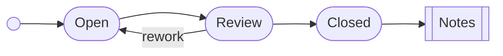

# Lifecycle

```mermaid
flowchart LR
    start(( )) --> Open([Open])
    Open --> Review([Review])
    Review --> Closed([Closed])
    Review -->|rework| Open
    Closed --> Notes[[Notes]]

    click Open href "states/open.md" "The open state"
    click Review "states/review.md" _blank
    click Closed href "states/closed.md";
    click Notes "#notes"
    click start callback "Start a ticket"
    click Docs href "https://mermaid.js.org/syntax/flowchart.html"
```

## Notes

Each state is a document of its own.
