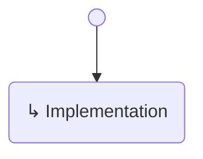

# § Instructions

Run `pf`, then follow the guidance it prints. Follow [Caller](#caller) next.

# Caller

## Graph

```mermaid
flowchart TD
    Entry(( )) --> Call(↳ Implementation)
    click Call href "#call"
```

### Implementation

#### Call

IMPLEMENTATION_SENTINEL
