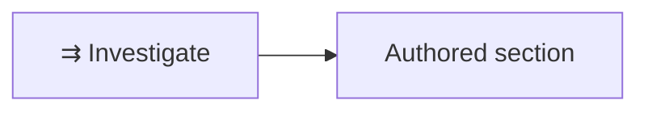

# Guide

## Plan

1. [⇉ Investigate](investigate.md).
2. Read [the authored section](#investigate).

```mermaid
flowchart LR
    Intake[⇉ Investigate] --> Authored[Authored section]
    click Intake href "investigate.md"
    click Authored href "#investigate"
```

### Investigate

An authored section.
