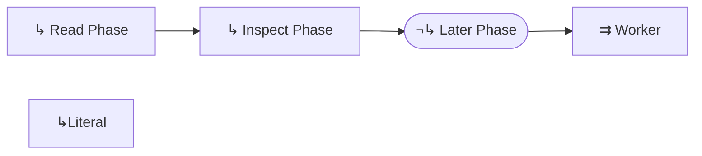

# Guide

## Flow

```mermaid
flowchart LR
    Read["↳ Read Phase"]; click Read href "phase.md#graph"
    Inspect@{ shape: rect, label: '↳ Inspect Phase' }
    Later([¬↳ Later Phase])
    Literal[↳Literal]
    Worker[⇉ Worker]
    Read --> Inspect --> Later --> Worker
    click Inspect href "phase.md#graph"
    click Later href "later.md#graph"
    click Literal href "phase.md#graph"
    click Worker href "worker.md"
```
