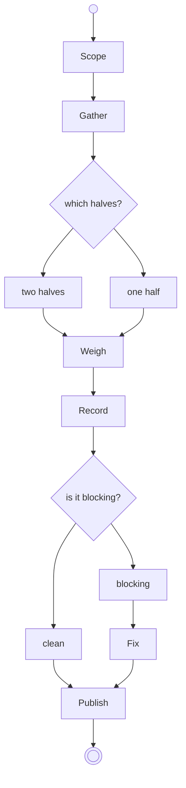

# Audit

The diagram is the workflow. Each state's section says what to do there, each decision's section says what it weighs, and each condition's section says when its escape applies.

```mermaid
flowchart TD
    start(( )) --> Scope
    Scope --> Gather
    Gather --> halves{"which halves?"}
    halves --> two[two halves]
    halves --> one[one half]
    two --> Weigh
    one --> Weigh
    Weigh --> Record
    Record --> verdict{"is it blocking?"}
    verdict --> blocking[blocking]
    verdict --> clean[clean]
    blocking --> Fix
    clean --> Publish
    Fix --> Publish
    Publish --> stop((( )))

    click Scope href "states/scope.md"
    click Gather href "states/gather.md"
    click halves href "decisions/halves.md"
    click two href "conditions/two-halves.md"
    click one href "conditions/one-half.md"
    click Weigh href "states/weigh.md"
    click Record href "states/record.md"
    click verdict href "decisions/verdict.md"
    click blocking href "conditions/blocking.md"
    click clean href "conditions/clean.md"
    click Fix href "states/fix.md"
    click Publish href "states/publish.md"
```
