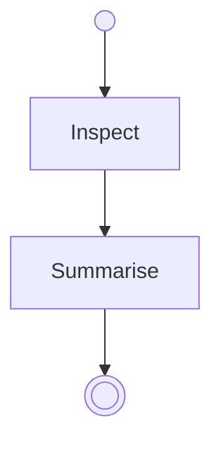

# Audit

The diagram is the workflow. Each state's section says what to do in that state and, by its marks, what it hands on.

```mermaid
flowchart TD
    start(( )) --> Inspect
    Inspect --> Summarise
    Summarise --> stop((( )))

    click Inspect href "states/inspect.md"
    click Summarise href "states/summarise.md"
```
