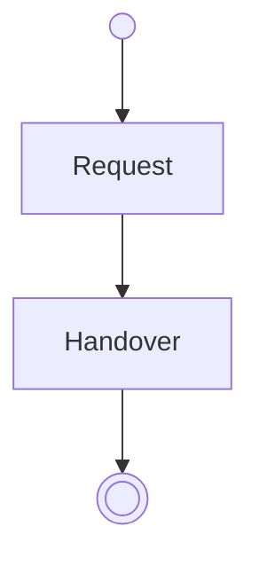

# Chain

The diagram is the workflow. Each state's section says what to do in that state and what it hands to a sub-agent.

```mermaid
flowchart TD
    start(( )) --> Request
    Request --> Handover
    Handover --> stop((( )))

    click Request href "states/request.md"
    click Handover href "states/handover.md"
```
