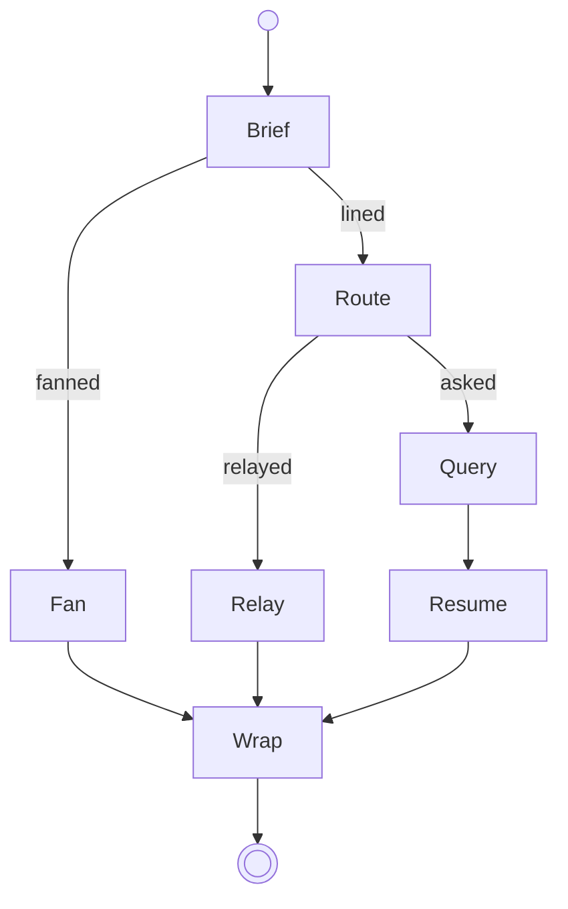

# Depth

The diagram is the workflow. Each state's section says what to do in that state, by its marks what it hands on, and which transition to take out of it.

```mermaid
flowchart TD
    start(( )) --> Brief
    Brief -->|fanned| Fan
    Brief -->|lined| Route
    Route -->|asked| Query
    Route -->|relayed| Relay
    Query --> Resume
    Fan --> Wrap
    Relay --> Wrap
    Resume --> Wrap
    Wrap --> stop((( )))

    click Brief href "states/brief.md"
    click Fan href "states/fan.md"
    click Route href "states/route.md"
    click Query href "states/query.md"
    click Relay href "states/relay.md"
    click Resume href "states/resume.md"
    click Wrap href "states/wrap.md"
```
