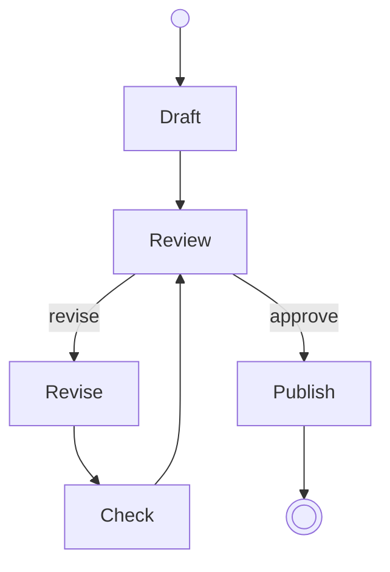

# Article

The diagram is the workflow. Each state's section says what to do in that state and which transition to take out of it.

```mermaid
flowchart TD
    start(( )) --> Draft
    Draft --> Review
    Review -->|revise| Revise
    Review -->|approve| Publish
    Revise --> Check
    Check --> Review
    Publish --> stop((( )))

    click Draft href "states/draft.md"
    click Review href "states/review.md"
    click Revise href "states/revise.md"
    click Publish href "states/publish.md"
```
