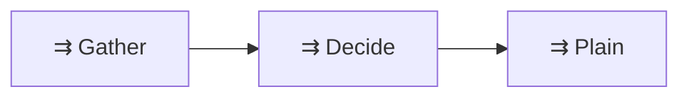

---
prosiform:
  default:
    levels:
      retrieval: haiku
      judgement: opus
---

# Guide


```mermaid
flowchart LR
  G["⇉ Gather"] --> D["⇉ Decide"] --> P["⇉ Plain"]
  click G "stages/gather.md"
  click D "stages/decide.md" "deep"
  click P "stages/plain.md"
```

- Nested:

  ```mermaid
  flowchart LR
    X["⇉ Gather"]
    click X "stages/gather.md"
  ```
