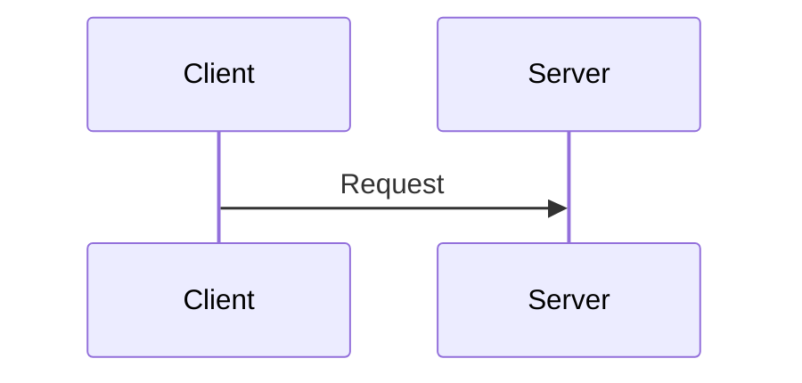

# Exchange

```mermaid
sequenceDiagram
    participant Client
    participant Server
    links Server: {"Server guide": "server.md", "Operations": "operations.md", "Runbook": "runbook.md"}
    Client->>Server: Request
```
