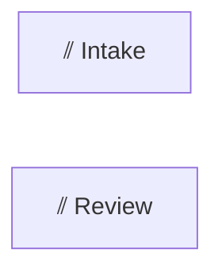

# § Instructions

Run `pf`, then follow the guidance it prints. Follow [Guide](#guide) next.

# Guide

## Flow

```mermaid
flowchart LR
    Intake[⫽ Intake]
    click Intake href "#⫽-dispatch-set"
    Review[⫽ Review]
    click Review "#⫽-dispatch-set"
```

### ⫽ Dispatch Set

[⇉ Intake](intake.bundle.md)
[⇉ Review](review.bundle.md)
