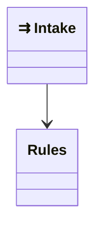

# § Instructions

Run `pf`, then follow the guidance it prints. Follow [Guide](#guide) next.

# Guide

```mermaid
classDiagram
    class Intake["⇉ Intake"]
    class Rules
    Intake --> Rules
    link Intake "intake.bundle.md"
    link Rules "#rules"
```

# Rules

Every rule the guide follows.
