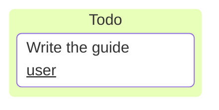
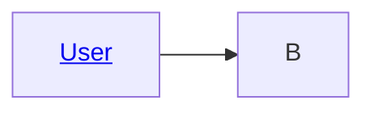

# Guide

```mermaid
%%{init: {"kanban": {"ticketBaseUrl": "https://tracker.example.com/browse/#TICKET#"}}}%%
kanban
    Todo
        [Write the guide]@{ ticket: user }
```

```mermaid
flowchart LR
    A["<a href='https://example.com/people/user.md'>User</a>"] --> B
```
