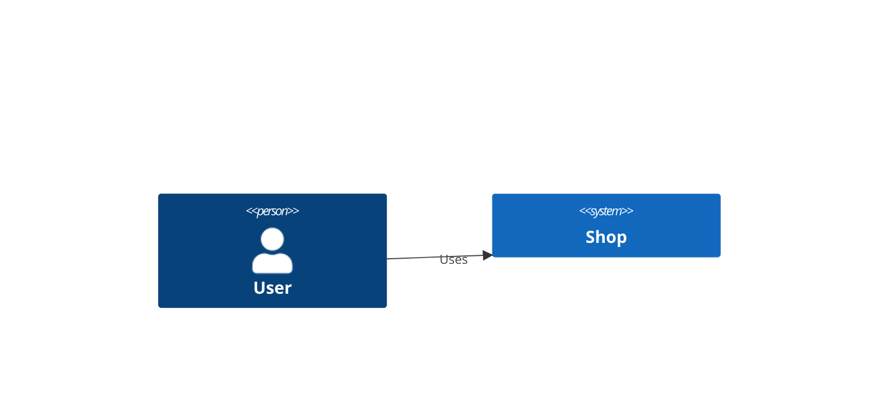
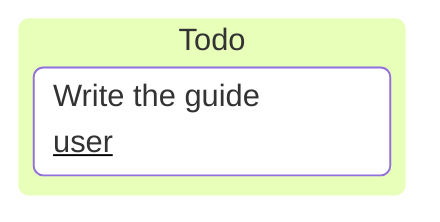
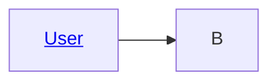
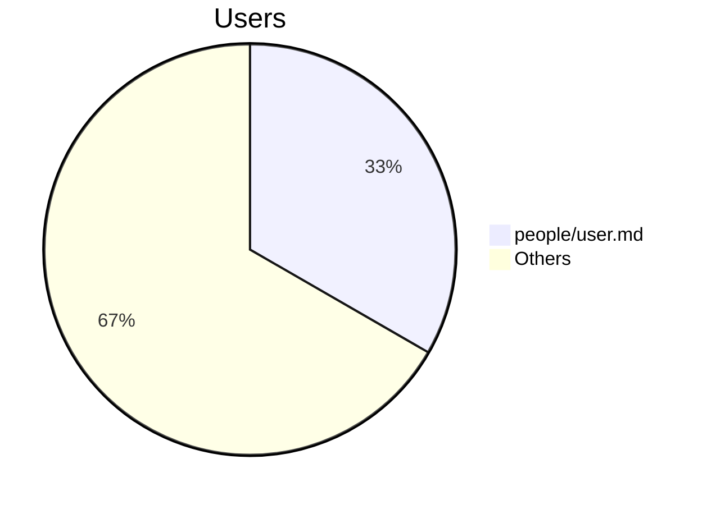

# Guide

```mermaid
C4Context
    Person(user, "User", $link="people/user.md")
    System(shop, "Shop")
    Rel(user, shop, "Uses", $link="people/user.md")
```

```mermaid
---
config:
  kanban:
    ticketBaseUrl: 'people/#TICKET#.md'
---
kanban
    Todo
        [Write the guide]@{ ticket: user }
```

```mermaid
flowchart LR
    A["<a href='people/user.md'>User</a>"] --> B
```

```mermaid
pie title Users
    "people/user.md" : 1
    "Others" : 2
```
