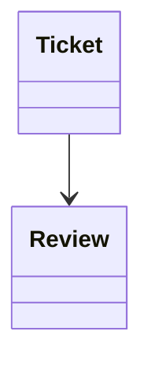

# § Instructions

Run `pf`, then follow the guidance it prints.

# Model

```mermaid
classDiagram
    class Ticket
    class Review
    Ticket --> Review

    link Ticket "#ticket" "The ticket type" _blank
    link Review "#review"
```

# Ticket

# Review
