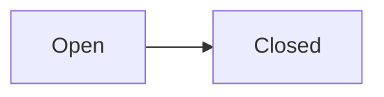

# § Instructions

Run `pf`, then follow the guidance it prints. Follow [Lifecycle](#lifecycle) next.

# Lifecycle

```mermaid
flowchart LR
    Open --> Closed

    click Open "#open" "The open state" _blank
    click Closed "#closing";
```

# Open

Work is under way.

# Closed

### Closing

Work is ending.
