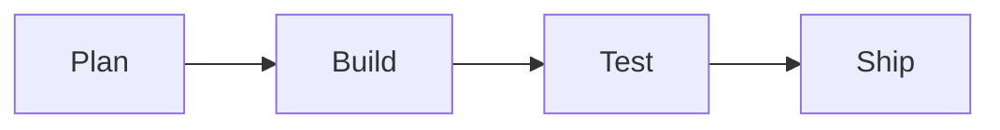

# Flow

```mermaid
flowchart LR
    Plan --> Build --> Test --> Ship

    click Plan href "#plan"
    click Build "#build"
    click Test "#test" "The test step"
    click Ship href "#ship" "The ship step" _blank
```

# Plan

# Build

# Test

# Ship
