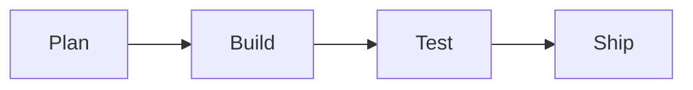

# Flow

```mermaid
flowchart LR
    Plan --> Build --> Test --> Ship

    click Plan href "steps/plan.md"
    click Build "steps/build.md"
    click Test "steps/test.md" "The test step"
    click Ship href "steps/ship.md" "The ship step" _blank
```
