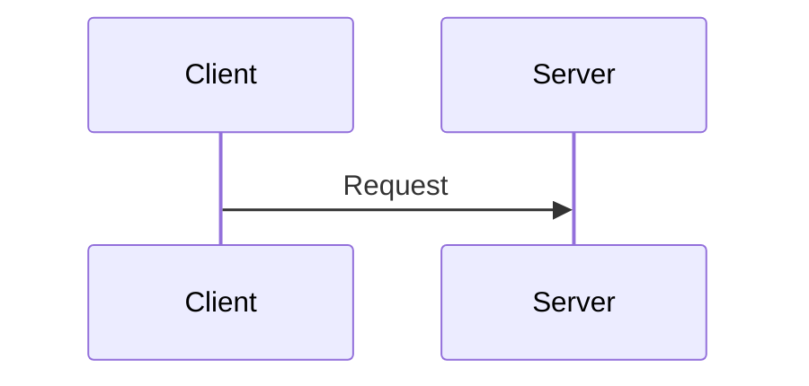

# Exchange

```mermaid
sequenceDiagram
    participant Client
    participant Server
    link Client: Setup @ #35;setup
    links Server: {"Limits": "#35;limits"}
    Client->>Server: Request
```

# Client

### Setup

Install the client.

# Server

### Limits

Ten requests a second.
