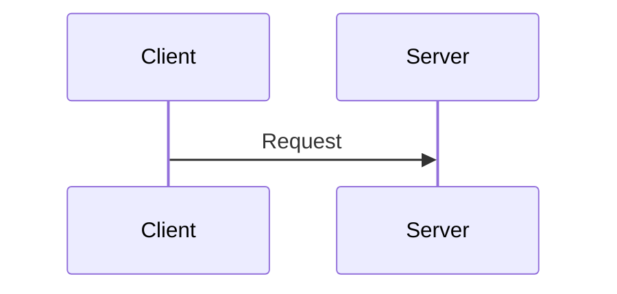

# Exchange

```mermaid
sequenceDiagram
    participant Client
    participant Server
    link Client: Setup @ docs/client.md#35;setup
    links Server: {"Limits": "docs/server.md#35;limits"}
    Client->>Server: Request
```
