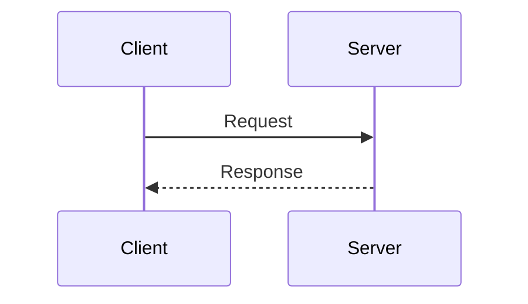

# Exchange

```mermaid
sequenceDiagram
    participant Client
    participant Server
    link Client: Client guide @ #35;client
    links Server: {"Server guide": "#35;server", "Operations": "#35;operations"}
    Client->>Server: Request
    Server-->>Client: Response
```

# Client

# Server

# Operations
