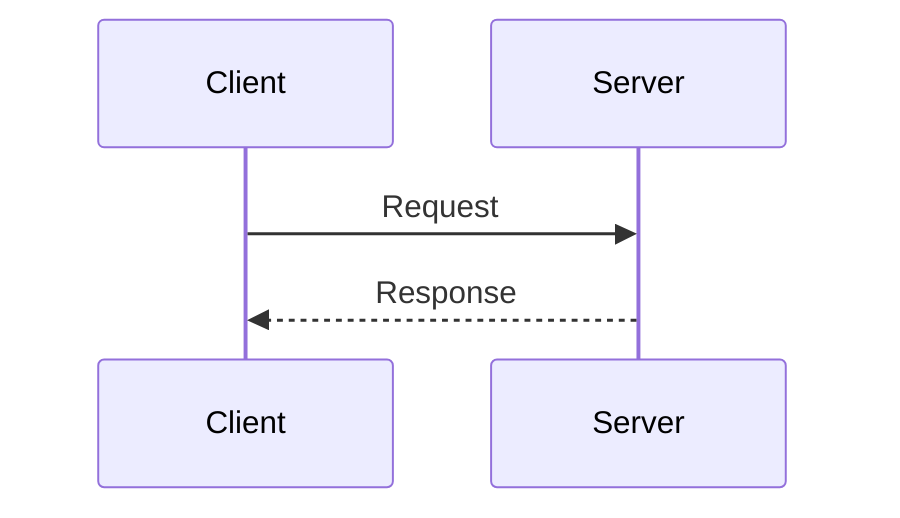

# Exchange

```mermaid
sequenceDiagram
    participant Client
    participant Server
    link Client: Client guide @ #35;client
    Client->>Server: Request
    Server-->>Client: Response
```

# Client
