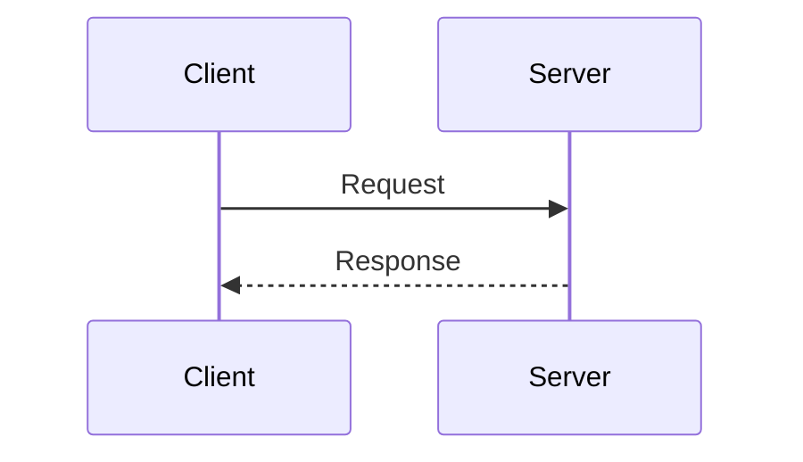

# Exchange

```mermaid
sequenceDiagram
    participant Client
    participant Server
    links Server: {"Server guide": "#server", "Operations": "#operations"}
    Client->>Server: Request
    Server-->>Client: Response
```

# Server

# Operations
