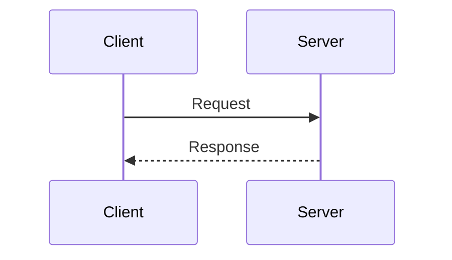

# Exchange

```mermaid
sequenceDiagram
    participant Client
    participant Server
    links Server: {"Server guide": "docs/server.md", "Operations": "docs/operations.md"}
    Client->>Server: Request
    Server-->>Client: Response
```
