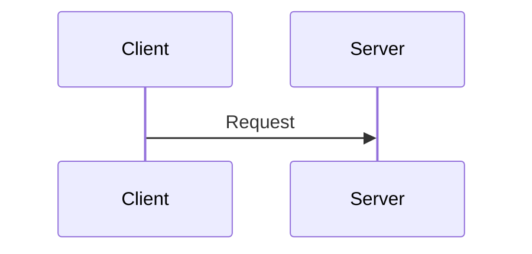

# Exchange

```mermaid
sequenceDiagram
    participant Client
    participant Server
    LINK Client: Client guide @ #35;client
    Links Server: {"Server guide": "#35;server"}
    Client->>Server: Request
```

# Client

# Server
