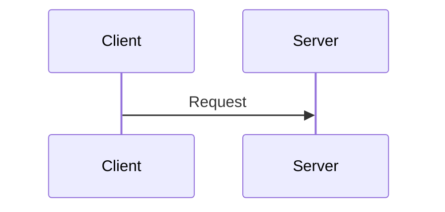

# Exchange

```mermaid
sequenceDiagram
    participant Client
    participant Server
    LINK Client: Client guide @ docs/client.md
    Links Server: {"Server guide": "docs/server.md"}
    Client->>Server: Request
```
