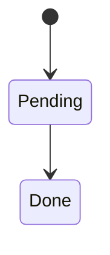

# § Instructions

Run `pf`, then follow the guidance it prints. Follow [States](#states) next.

# States

```mermaid
stateDiagram-v2
    [*] --> Pending
    Pending --> Done

    click Pending href "#pending"
    click Done "#done" "The finished state"
```

# Pending

# Done
